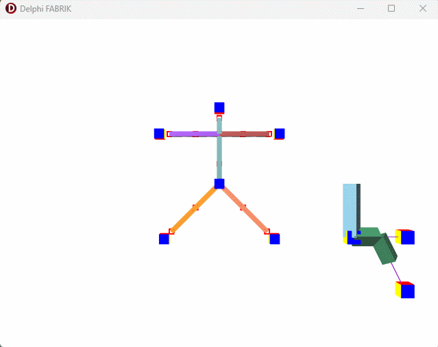

# Delphi FMX FABRIK IK Solver

This repository provides a Delphi FMX implementation of the **FABRIK** (Forward And Backward Reaching Inverse Kinematics) IK solver.

## Features

- **TDragCube**: A 3D cube component that can be dragged and dropped in 3D space at runtime.
- **3-Bone System**: Demonstrates how to orient a mesh in 3D using a simple bone chain.
- **FABRIK IK Solver**: A full implementation of the FABRIK algorithm for use in FMX 3D applications.

